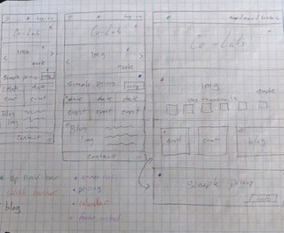
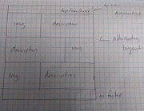

## Project Title
Co-working Website Design

#### Names of Author(s)
Chris Breaux

#### Date of Completion

2.22.2019 (Design)

2.29.2019 (Build-out)

### Description

This project is intended to mimic the freelance process of designing and developing a website for a client. In this case, the client is a newly constructed co-working space who have a clear vision for their space and website. Given the following conversation snippets, this project is an attempt to meet the clients' needs.

* "We just finished remodeling our space. We're really proud of it. We want our online presence to mirror our in-person presence, to attract people that would really enjoy working in our environment." (They later email you the following photos detailing their space's aesthetic: coffee counter area, communal workspace, one of our meeting areas, front entrance, front entrance looking out).

* "We want our space--no, our whole company--to feel a little luxurious, cool, and high-end; yet still 100% welcoming and inclusive to everyone. A safe, comfortable, and productive work environment, you know?"

* "I also think it's really important convey our unique personality. It's what sets us apart from the 'big guys' in the field. You know, places like WeWork and TechSpace. We think we're more funky, more local, less corporate, and a little more fun."

* "We want to avoid catering solely to tech. You walk into some of these other coworking spaces, and you only ever see people working on code. That's great, but we'd also love to see artists, daytraders, craftspeople, writers, counselors, more traditional business people--you know, anyone and everyone--in our space."

* "Our site should also show what amenities we have. We have an on-site coffee counter, both communal working areas and private offices, high-speed internet, printing and faxing services, and we usually have a fun, optional activity on Thursday afternoons. Like yoga, maybe a fun complementary food, or like...I don't know, maybe even crafts sometimes (come make your own mini desktop terrarium)?"

### Initial Sketches

#### Desktop Version

#### Mobile Version

### User Personas

### Target Users

* Freelancers
* Digital Nomads
* Craftspeople/Artisans
* Small Business Owners
* Current Users of the Co-working space
* Co-working Space Owners

### User Stories
* As a freelancer, I'd like to know what office amenities I can expect to know if the co-working space has everything I need to do my job.

* As a freelancer, I need to know how much it costs to utilize the space to see if it's affordable.

* As a freelancer, I'd like to know what kind of people or business use the space so that I can see if I would fit into the culture and environment of the space.

* As a digital nomad, I need to know if there are minimum contract lengths or daily use rates as I am unsure of my length of stay.

* As a small business owner, I need to know what accommodations are available for groups so that I can determine if there will be room for my team.

* As a small business owner, I regularly hold meetings and conferences with employees and clients so I need a way to reserve any meeting rooms so that I know they're available when we need them.

* As a current co-worker, I need to know what events or activities are occurring in the space so I can schedule my time accordingly.

* As a current co-worker, I need a way to quickly communicate to other members of the co-working space to better facilitate the cooperative nature of the space.

* As a current co-worker, I need a way to easily pay for my usage fees because the simpler I can make my bookkeeping, the better.

* As an owner of the co-working space, I need statistics about traffic and use of the site to better target my marketing efforts.

* As an owner of the co-working space, I need a way to add events and photos easily to keep the information on the site current.

### Research and Brainstorming
I went looking for inspiration from other co-working spaces in San Francisco and Austin and made notes on my impressions. My hope was to find sites that meshed with the client's requirements.

Sites like https://thevault.co/ and http://madeatcraft.com/ used high-quality photos of people working together and bright bold colors that added to a sense of fun.

Another site http://www.eastsidecollective.com/ did a great job with conveying a clean, modern approach but I think it would be to sterile for this particular clients' needs.

Finally, https://www.spacesworks.com/ was notable for its clear navigability and inclusion of features I would hope to implement including a calendar section and blog. Aesthetically, it seemed a bit too dry for this project.

The big takeaways for me were how important it was to highlight people actually working together instead of just empty rooms. Also, the palette of the site should use bright colors to convey a positive, fun energy. The initial impression when visiting a site is crucial to the user experience.

Layout: Use space and arrangement to evoke the modern, cool vibe.
Colors: Bright and bold
Typography: Interesting header with readable text
Photos: Show how the space is being used, highlight collaboration.

For this project, the layout and spacing will be important to convey the modern, cool vibe the client is looking for. I'll prominently display HD photos of people collaborating in the space to quickly evoke the co-operative nature of the work-space. A bold color palette and high-contrast typography will be used to convey a sense of fun and energy that will set this site apart from more corporate spaces. An inclusion of blog posts and an event calendar will be used to foster inclusivity for current and potential co-workers alike.

### Technologies and Resources

* Sketch v50.2

### Responsiveness

### Setup Instructions

### Roadmap

### License

GNU License

Copyright (c) 2019 **Chris Breaux**
